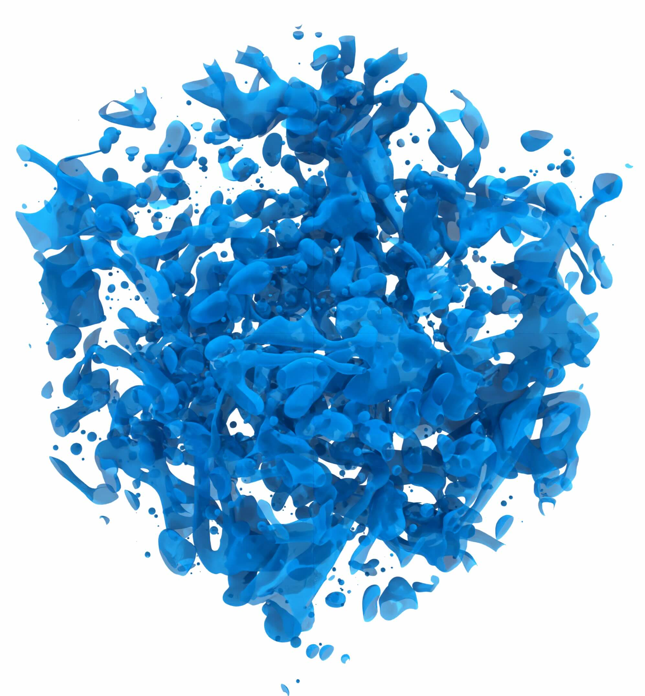

# MHIT36

Multi-GPU code for intreface-resolved simulations of multiphase turbulence.
The code relies on direct numerical simulation of Navier-Stokes equations coupled with a phase-field method (ACDI) for interface description.
The code parallerelization relies on the cuDecomp library.


~~~text
███    ███ ██   ██ ██ ████████ ██████   ██████       
████  ████ ██   ██ ██    ██         ██ ██              
██ ████ ██ ███████ ██    ██     █████  ███████   
██  ██  ██ ██   ██ ██    ██         ██ ██    ██     
██      ██ ██   ██ ██    ██    ██████   ██████        
~~~


If you use this code, please cite the following work: 
```bibtex
  @article{roccon2025,
  title   = {MHIT36: A Phase-Field Code for Gpu Simulations of Multiphase Homogeneous Isotropic Turbulence},
  author  = {Roccon, A. and Enzenberger, L. and Zaza, D. and Soldati, A.},
  journal = {Computer Physics Communications},
  year    = {2025},
  volume  = {314},
  issue   = {109804},
  doi     = {https://doi.org/10.1016/j.cpc.2025.109804}
}
```




## Run the code

- Compile the cuDecomp library using *_lib.sh, the resulting modules and library will be located in cuDecomp/build/lib and cuDecomp/build/include; manual compilation can be performed using the Cmake avaialble in the cuDecomp repository.
- Double check cuDecomp building is fine (must be compiled using HPC-SDK)
- Folder multi: contains the source-code of the multi GPU version of the code. Use local.sh, leo.sh or mn5.sh to compile and run the code.
- Code by default is set in full autotuning (pr=0 and pc=0). cuDecomp will perform an autotuning at the start finding the best decomposition (the only input is the total number of tasks). In this way, everything is automatic and the code does not need to be recompiled when changing the number of MPI processes. Also backend is automatically defined.
- A conditional compilation flag is used to enable or not the phase-field module. By default is single-phase only.


## Reference performance and scaling

Performance (NS only)
* 128 x 128 x 128    |   1 x A100@Leonardo  |   1 ms/timestep
* 256 x 256 x 256    |   1 x A100@Leonardo  |   8 ms/timestep
* 512 x 512 x 512    |   1 x A100@Leonardo  |  65 ms/timestep 
* 128 x 128 x 128    |   4 x A100@Leonardo  |   1 ms/timestep
* 256 x 256 x 256    |   4 x A100@Leonardo  |   3 ms/timestep
* 512 x 512 x 512    |   4 x A100@Leonardo  |  18 ms/timestep 
* 512 x 512 x 512    |   4 x H100@MN5-ACC   |  14 ms/timestep 
* 1024 x 1024 x 1024 |   4 x A100@Leonardo  | 150 ms/timestep 
* 2048 x 2048 x 2048 |  64 x A100@Leonardo  | 330 ms/timestep
* 4096 x 4096 x 4096 | 256 x A100@Leonardo  | 780 ms/timestep

Phase-field introduces about 20% of overhead compared to NS only.
Max resolution tested: 4096^3
Max number of GPUs used: 512 (Leonardo) and 1024 (MN5)

## Validation

Benchamrk present in "W.M.VanRees, A.Leonard, D.Pullin, P.Koumoutsakos, A comparison of vortex and pseudo-spectral methods for the simulation of periodic vortical flows at high Reynolds numbers,J. Comput. Phys.2 30(8)(2011)2794–2805" and also Used in CaNS.

Time evolution of the viscous dissipation:


Single refers to the single-GPU implmenetation of the code, which is available [here](https://github.com/aroccon/MHIT36_single)

## Contributing

We welcome all contributions that can enhance MHIT36, including bug fixes, performance improvements, and new features. 
If you would like to contribute, please contact aroccon or open an Issue in the repository.

## Acknowledgements

We would like to thank the follwing people for the support received during the code development and optimization (as well as CINECA and the Open Hackathons program)
- Matt Bettencourt
- Josh Romero
- Laura Bellentani
- Alessio Piccolo
- Pedro Costa 
- Simone Di Giorgio